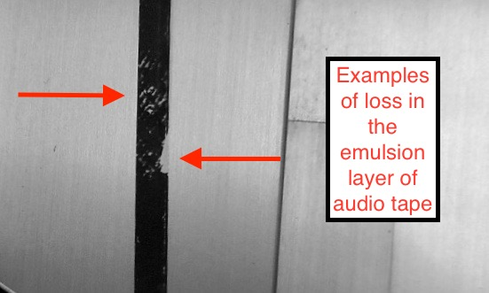

# Condition Summary Description Examples. 

  
## Overview. 
The following are examples of the conditions noted in the original object metada in the Himan Brown audio collections.  

## Condition examples

### Loss in the emulsion layer of audio tape.  

. 

### Mold contamination.  
. 

### Additional unidentified audio tape stock spliced into the tape pack 
. 

### Failed tape splice   

*Example 1, desicated splice adhesive* 
. 

*Example 2, oozing splice adhesive which has migrated to the pack surface*  

. 
  
*Example 3, separated splice**  

### Water or liquid damage
. 

### Not stored in an archival wind 
.   

### Shrunken tape base 

### Damaged leader tape. 

  
### Soft Binder Syndrome. 

The following tape formulations typically suffer from soft binder syndrome. Other formulations may also be at risk as well.

Scotch / 3M: 175   
Sony: PR-150   
Melody: 169   
Pyral : various formulations   

### Sticky Shed Syndrome
  
  
The following tape formulations typically suffer from sticky shed syndrome.  Other formulations may also be at risk as well.  

Agfa: PEM 468 \(Pre-1990\) and PEM 469      
Ampex/Quantegy:  406, 407, 456, 457 and 478.    
Audiotape/Capitol: Q15 \(Early 1980s\)  
Scotch/3M: 226, 227, 250, 806, 807, 808 and 809.  
  
  ### Azimuth varies throughout.  
  
  Programs in the Himan Brown tape collection are often open-reel tape with multiple edits; the azimuth among the edited tape is often unrelated.
  
  The following is an example of phase analysis of four excerpts from a single program in azimuth in a single program:  
  
*Example 1, calibration tone.*  
. 
*Example 2, first edit.*  
. 
*Example 3, second edit.*   
.
*Example 4, third edit.* 
. 
