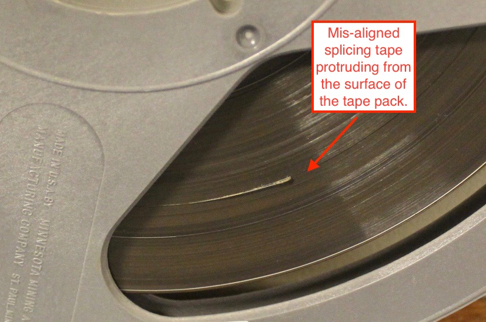
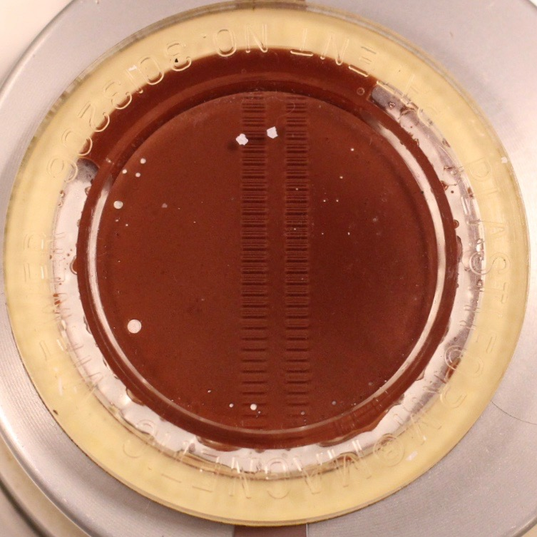

# Condition Summary Description Examples. 

  
## Overview. 
The following are examples of some of the conditions noted in the original object metada in the Himan Brown audio collections.  

## Loss in the emulsion layer of audio tape.  

. 

## Mold contamination.  
. 

## Additional unidentified audio tape stock spliced into the tape pack 
. 

## Failed tape splice   

*Example 1, desicated splice adhesive* 
. 

*Example 2, oozing splice adhesive which has migrated to the pack surface*  

. 
  
*Example 3, separated splice**  

  

*Example 4, mis-aligned splicing tape**  

## Water or liquid damage
. 

## Not stored in an "archival wind"  

*Example 1*  
  

*Example 2*  

## Shrunken or other dimmensional change in the tape base 

## Damaged leader tape. 

  
## Soft Binder Syndrome. 

The following tape formulations typically suffer from soft binder syndrome. Other formulations, not listed here, may also be at risk.

>Scotch / 3M: 175   
>Sony: PR-150   
>Melody: 169   
>Pyral : various formulations   

## Sticky Shed Syndrome
  
  
The following tape formulations typically suffer from sticky shed syndrome.  Other formulations, not listed here, may also be at risk.

>Agfa: PEM 468 \(Pre-1990\) and PEM 469      
>Ampex/Quantegy:  406, 407, 456, 457 and 478.    
>Audiotape/Capitol: Q15 \(Early 1980s\)  
>Scotch/3M: 226, 227, 250, 806, 807, 808 and 809.  
  
  ## Azimuth varies throughout.  
  
  Programs in the Himan Brown collection are often recorded on open-reel tape and produced with multiple physical edits within a single program. The azimuth among the sections of tape edited together in these programs often varies.
  
  The following is an example of phase analysis of four excerpts from a single program.  The changes  seen in the analysis suggests variation in azimuth among the examples. In the following set of examples, the playback deck reproduce head azimuth was aligned with the tape for maximum response in *Example 1, calibration tone phase*, and not realigned again for *Examples 2, 3 and 4*: 
  
*Example 1, calibration tone phase.*  
  

*Example 2, first edit phase.*  
  

*Example 3, second edit phase.*   
  

*Example 4, third edit phase.* 
 
  
## Formatting. 

*Example, full-track*.  

  
  
*Example, full-track*.  

.
  
    
## Damaged container.  

## Dirt or other articulate matter. 

