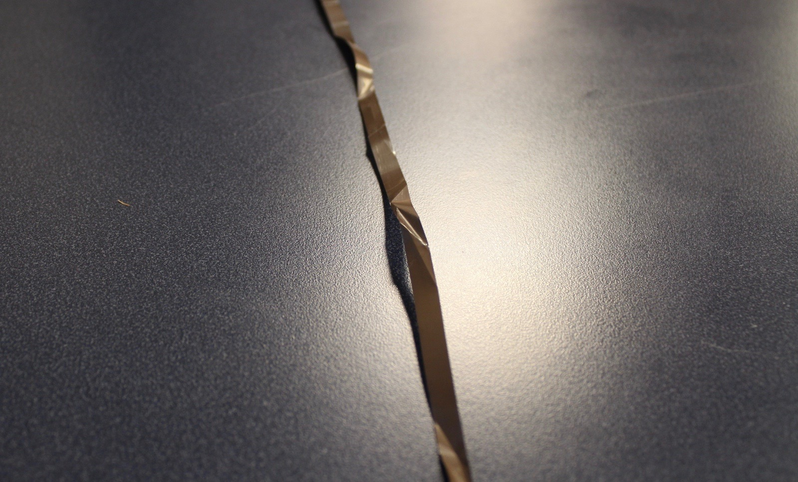
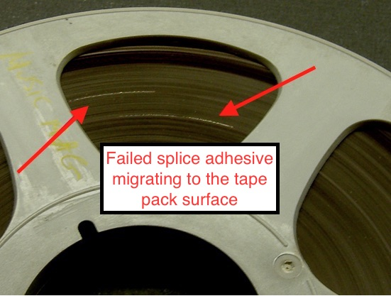
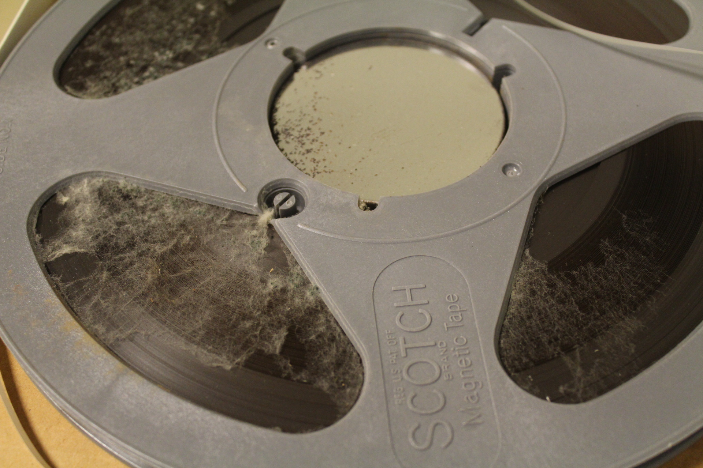

# Condition Summary Description Examples 

 
## Overview. 
The following are examples of some of the conditions noted in the original object metada in the Himan Brown audio collections.  

## Additional unidentified audio tape stock spliced into the tape pack  
*Example* 
.
  
## Azimuth varies throughout.  
  
  Open-reel tapes marked "copy 1" in  Himan Brown collection are produced with multiple physical edits within a single program. The azimuth between the sections of edited tape often varries significantly.
  
  The following is an example of phase analysis of four excerpts from a single program.  The changes  seen in the analysis suggests variation in azimuth among the examples. In the following set of examples, the playback deck reproduce head azimuth was aligned with the tape for maximum response in *Example 1, calibration tone phase*, and not realigned again for *Examples 2, 3 and 4*: 
  
*Example 1, calibration tone phase analysis.*  
  

*Example 2, first edit phase analysis.*  
  

*Example 3, second edit phase analysis.*   
  

*Example 4, third edit phase analysis.* 
   
   
 ## Damaged container.   
*Example* 

    
## Damaged leader tape.  
*Example* 

## Dimmensional change in the tape base   
*Example 1, creased and folded mylar base*.  

. 

*Example 2, shrunken acetate base*.

   

*Example 2, stretched mylar-based tape*.

   

## Dust or other particulate matter.   
*Example* 
. 
## Failed splicing tape adhesive  

*Example 1, desicated splicing tape adhesive* 
. 

*Example 2, oozing splice adhesive which has migrated to the pack surface*  

. 
  
*Example 3, separated splice joint and mis-aligned splicing tape**  

  

*Example 4, mis-aligned splicing tape prodtruding**  

 

*Example 5, compound splice with failed splicing tape removed **  

*Example 6, oozing splicing tape adhesive on the emulsion layer of the audio tape adhering the deck heads **  

    
## Formatting. 

*Example, full-track*.  

*Example, full-track with error, likely caused by a misaligned record head*.  

  
*Example, two-track*.  

.  

*Example, quarter-track*.  

. 

*Example, full-track with Nagra pilot*.

.

*Example, full-track with Rangertone pilot*.

.

*Example, Rangertone pilot with no audio signal*.

.

## Loss in the emulsion layer of audio tape.  
*Example* 

. 

## Mold contamination.  

*Example 1* 
.

*Example 2* 
.

*Example 3* 
.   

*Example 4* 
.   

*Example 5* 
.   

## Not stored in an "archival wind"  

*Example* 
.

## Soft Binder Syndrome. 

The following tape formulations typically suffer from soft binder syndrome. Other formulations, not listed here, may also be at risk.

 * Scotch / 3M: 175   
 * Sony: PR-150   
 * Melody: 169   
 * Pyral : various formulations   

## Sticky Shed Syndrome
  
  
The following tape formulations typically suffer from sticky shed syndrome.  Other formulations, not listed here, may also be at risk.

 * Agfa: PEM 468 \(Pre-1990\) and PEM 469      
 * Ampex/Quantegy:  406, 407, 456, 457 and 478.    
 * Audiotape/Capitol: Q15 \(Early 1980s\)  
 * Scotch/3M: 226, 227, 250, 806, 807, 808 and 809.  
  
## Water or liquid damage. 
*Example* 
. 
